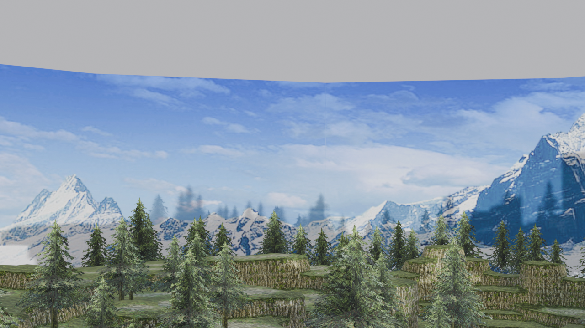
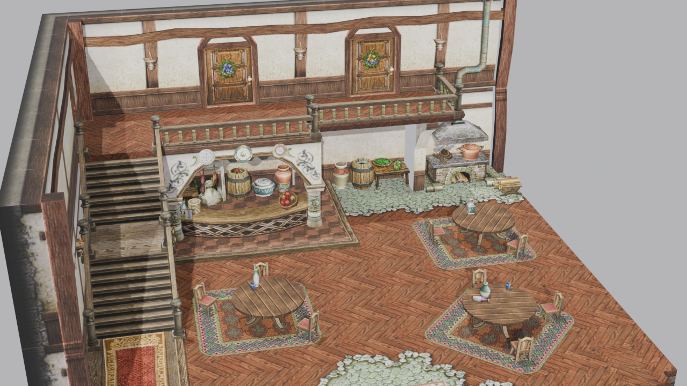
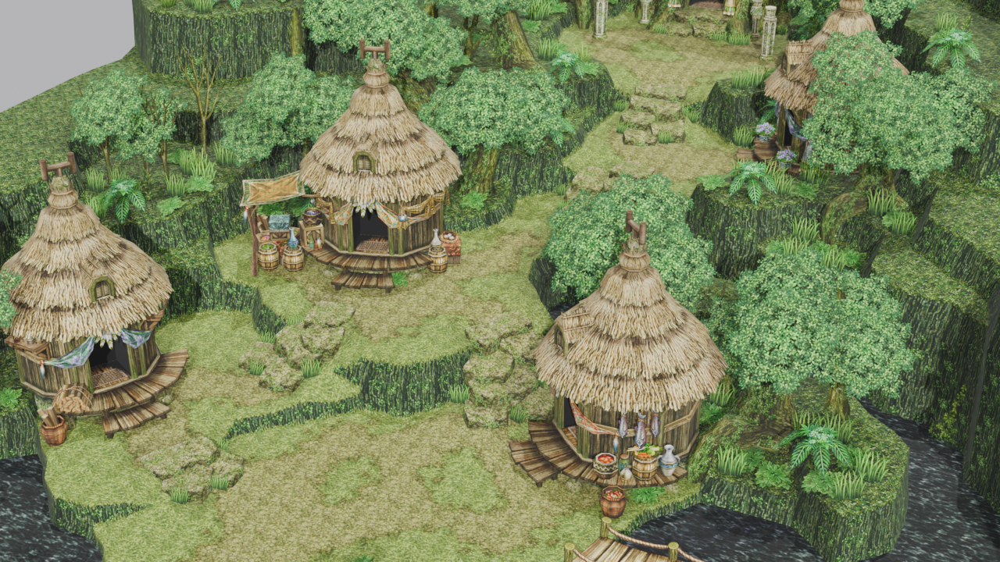
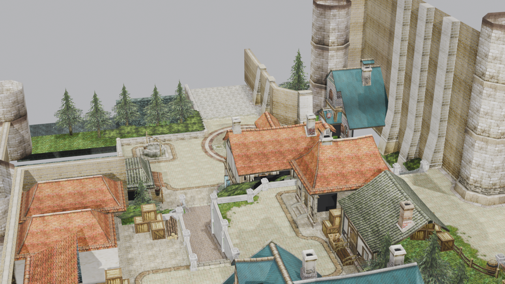
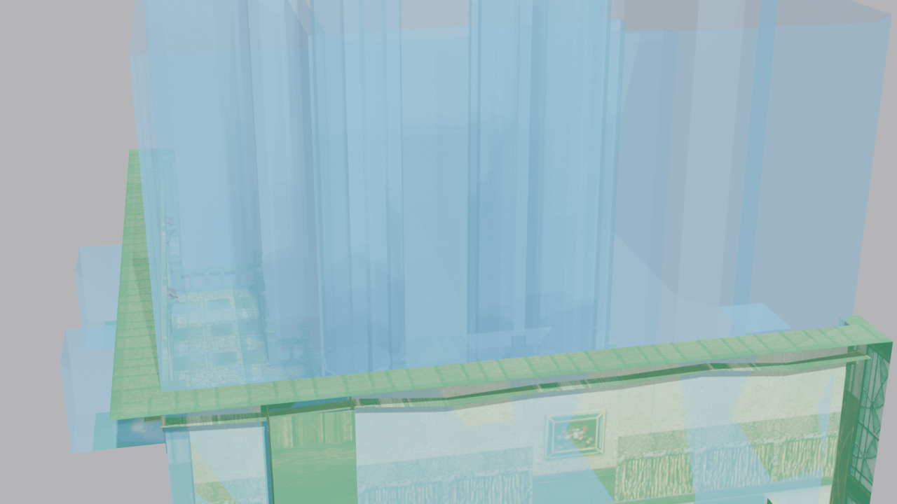

# Ys 3D Rendering & Map Extraction Pipeline

[](LICENSE)
[](flake.nix)

Turnkey reverse engineering, extraction, and 3D conversion pipeline for Nihon Falcom's **Napishtim Engine** PC titles (*Ys: The Oath in Felghana*, *Ys Origin*, and *Ys VI: The Ark of Napishtim*). Converts proprietary game archives (`.na`/`.ni`), map geometry (`.ymo`), collision meshes (`.yco`), and stage object placement scripts (`.sob`) into standard **glTF 2.0 / GLB** and **Wavefront OBJ** models ready for topology and UV analysis in Blender.

---

## 📸 Showcase Renders

### 1. Tigray Quarry (`S_1000`) — The 2.5D Flat Backdrop Perspective Trick
Falcom's fixed isometric camera uses a flat vertical plane (`10back06.dds`) standing directly behind the 3D bridge and river terrain to create the optical illusion of an expansive mountain range at virtually zero polygon cost.


### 2. Redmont Tavern & Inn (`S_0100`)
Full interior scene with wooden herringbone floor, dining tables, rugs, wine bottles, pink cushion chairs, and half-timber walls.


### 3. Village Scene (`S_0000`)
Village environment with alpha-clipped foliage canopies, thatched roofs, grass paths, and streams.


### 4. Castle Gate & Outskirts (`S_2000`)
Twin circular towers, stone battlements, blue spires, and courtyard market stalls.


### 5. Tri-Layer Collision Geometry (`.YCO`)
Decoupled collision layers: **Emerald Green** for walkable stepping surfaces (`__S.YCO`) and **Cyan Blue** for camera bounding frustums (`__C.YCO`).


---

## 🎮 Verified Compatible Games (Steam)

| Game Title | Steam AppID | Archive Path | Status |
|---|---|---|---|
| **Ys: The Oath in Felghana** | `579450` | `steamapps/common/Ys The Oath in Felghana/release/data.ni` | **Verified (231/231 stages)** |
| **Ys Origin** | `207350` | `steamapps/common/Ys Origin/release/data.ni` | **Verified (1,006+ models)** |
| **Ys VI: The Ark of Napishtim** | `312540` | `steamapps/common/Ys VI/release/data.ni` | **Verified (424+ models)** |

---

## 🚀 Quickstart

### 1. One-Command Turnkey Extraction & Conversion (All Installed Ys Games)
Automatically discovers all installed Steam games (*Ys: The Oath in Felghana*, *Ys Origin*, and *Ys VI: The Ark of Napishtim*), extracts all map archives, and batch-converts all stage scenes and 3D models into textured `.glb` files with discrete nodes and alpha masks:
```bash
# Process all installed Ys games:
./scripts/extract_and_convert_all.sh

# Or specify a single game:
python3 src/cli.py extract-and-convert-all --game felghana --workers 12
python3 src/cli.py extract-and-convert-all --game origin --workers 12
python3 src/cli.py extract-and-convert-all --game ys6 --workers 12
```
### 2. Inspect Directly in Windows Host Blender
Automatically generates a native `.blend` project, imports the model, adds directional Sun lighting, sets the 3D viewport directly into **`RENDERED`** mode, and unlocks object modes for wireframe analysis:
```bash
# Open any stage in Windows Blender:
python3 src/cli.py open-in-blender output/stages/S_00/S_0000/S_0000_composite.glb
python3 src/cli.py open-in-blender output/stages/S_01/S_0100/S_0100_composite.glb
python3 src/cli.py open-in-blender output/stages/S_20/S_2000/S_2000_composite.glb
```

### 3. Individual Conversions
```bash
# Convert a single .YMO model to GLB:
python3 src/cli.py convert-model extracted/MAP/S_01/S_0100/S_0100.YMO --output output/S_0100.glb

# Convert a single .YMO model to Wavefront OBJ:
python3 src/cli.py convert-model extracted/MAP/S_01/S_0100/S_0100.YMO --format obj --output output/S_0100.obj

# Assemble a composite stage (.SOB placement):
python3 src/cli.py convert-stage extracted/MAP/S_01/S_0100/S_0100.SOB --output output/S_0100_composite.glb
```

---

## 🔬 Engine Architecture & Reverse Engineering Findings

Comprehensive technical specifications are documented in [`docs/FORMAT_SPECS.md`](docs/FORMAT_SPECS.md).

### Key Technical Insights:
1. **Master Terrain vs. Dynamic Props:**
   - The static world (ground, architecture, bridges, water basins) is modeled as a unified master `.YMO` mesh partitioned into submeshes by texture.
   - Dynamic, interactive, or animated objects (doors, torches, chests, levers, moving platforms) are instantiated via `.SOB` placement scripts with position, Euler rotation, and scale.
2. **1-Based Submesh Material Indexing:**
   - The submesh descriptor field $f_6$ is a **1-based index** ($1 \rightarrow \text{Mat } 0, 2 \rightarrow \text{Mat } 1, \dots, N \rightarrow \text{Mat } N-1$). Mapping $f_6$ directly as 0-based results in off-by-one texture assignments across the stage.
3. **Multi-Stream Vertex Buffers:**
   - Models with secondary vertex streams (e.g. `S_1000`, `S_0200`) store primary coordinates in Stream 1 (40B stride) followed by auxiliary attributes in Stream 2 (8B stride).
4. **Foliage & Texture Alpha Masks:**
   - Textures containing alpha cutout channels (e.g. `1_GRASS.DDS`, tree leaf clusters, hanging ferns) are configured with `alphaMode = "MASK"` and `alphaCutoff = 0.5` to eliminate solid background quads.
5. **Decoupled Tri-Layer Collision (`.YCO`):**
   - Ground stepping (`__S.YCO`), barrier walls (`__W.YCO`), and camera bounding frustums (`__C.YCO`) are stored in separate 96-byte polygon records, color-coded and organized into hidden-by-default Outliner collections.

---

## 📂 Repository Structure

```
ys-rendering/
├── flake.nix                  # Nix Flake providing development environment
├── LICENSE                    # MIT License
├── README.md                  # Public documentation & showcase
├── ORIENTATION.md             # Guide for future coding sessions
├── docs/
│   ├── FORMAT_SPECS.md        # Exhaustive binary format specifications (.NA, .NI, .YMO, .YCO, .SOB)
│   └── images/                # Showcase renders and diagrams
├── scripts/
│   └── extract_and_convert_all.sh # One-command turnkey batch conversion wrapper
└── src/
    ├── cli.py                 # Unified command-line interface
    ├── extractor/
    │   └── archive.py         # NNI decryption (LCG cipher) and zlib decompressor
    ├── converter/
    │   ├── ymo_parser.py      # Binary parser for .YMO geometry and multi-stream buffers
    │   ├── yco_parser.py      # Binary parser for .YCO collision meshes
    │   ├── gltf_exporter.py   # glTF 2.0 / GLB exporter (PBR materials, alpha masks, UVs)
    │   ├── obj_exporter.py    # Wavefront OBJ/MTL exporter
    │   └── stage_builder.py   # Modular composite stage scene assembler (.SOB placements)
    └── tools/
        ├── open_blender.py    # Windows host Blender launcher (.blend project generator)
        ├── blender_import.py  # Blender scene organizer (Collision & Trigger collections)
        ├── render_clean.py    # Headless Blender render tool
        └── generate_readme_renders.py # Showcase image generation script
```

---

## 📜 License

This project is licensed under the [MIT License](LICENSE).
Game assets, models, and textures remain the copyright of Nihon Falcom Corporation.
